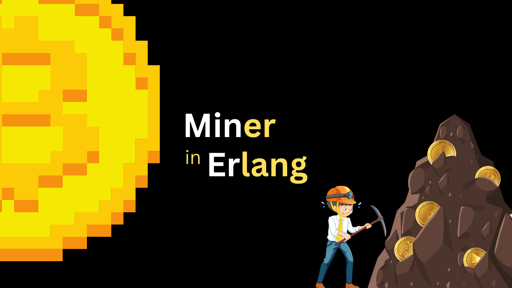
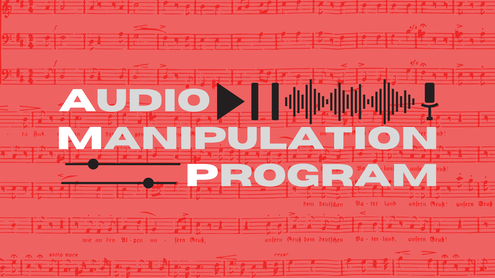
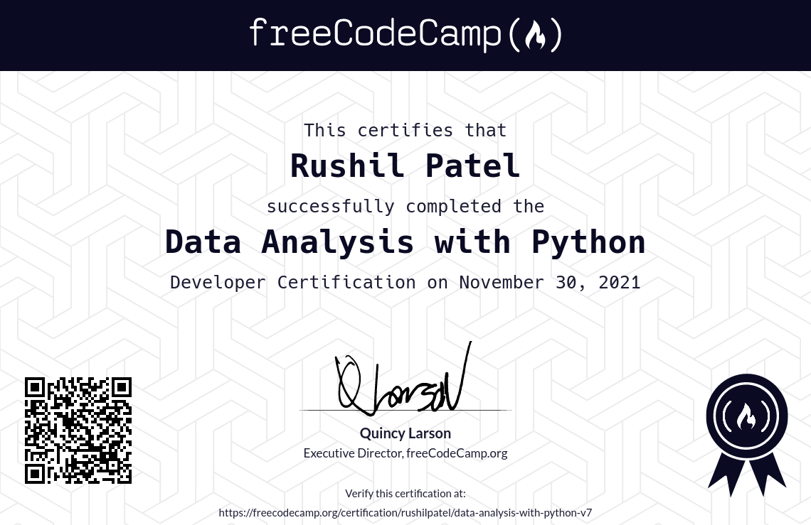
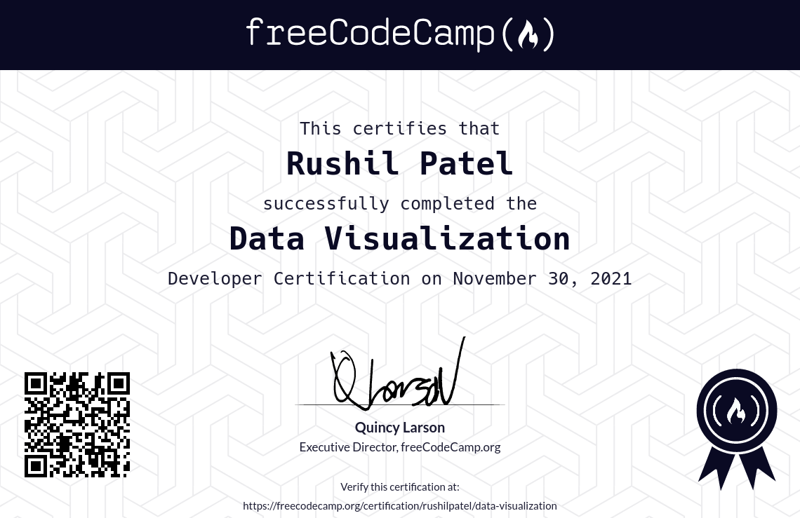

<!-- SECTION: Introduction -->

  

    <h1>
      <a id="Introduction">
        Introduction 👋
      </a>
    </h1>
  

  
  

  <h3>My name is Rushil Patel and I create awesome web apps!</h3>
  
  <h3>I’m a <a rel="noopener noreferrer" target="_blank" href="#Experience">Full-Stack Developer experienced in designing and building highly performant front-end and back-end systems for the Internet</a>.</h3>

---

<!-- SECTION: About Me -->

  

    <h1>
      <a id="About">
        More About Me 🤓
      </a>
    </h1>
  

    

  Hello again! I am Rushil, a graduate student (MS CS) at the [University of Florida](https://www.ufl.edu/). A decade ago, I accidentally stumbled upon Chrome's DevTools and found out that I had the power to modify any piece of content on any webpage. Although I had been fascinated by computers before, this discovery sparked a newfound passion and curiosity inside me about the inner workings of a computer. Ever since, I have been tinkering with computer code of all shapes and sizes for fun -- even built an audio workstation software (in MATLAB, of all things, check out my <a rel="noopener noreferrer" target="_blank" href="#Projects">featured projects</a>!)

  Fast-forward to today, and pursuing my Master's Degree has strengthened that passion and helped me realize how wonderful the field of Computer Science truly is. Not only that, but working as a <a rel="noopener noreferrer" target="_blank" href="#Experience">Full-Stack Developer for a year</a> has instilled in me the value of effective communication, leadership, and problem-solving skills.

---

<!-- SECTION: Work Experiences -->

  

    <h1>
      <a id="Experience">
        Work Experiences 👨‍💻
      </a>
    </h1>
  

  <!-- SUB-SECTION: Experience 1 -->
  

    

      <table align="center">
        <tr>
          <th><h2> &nbsp; Full-Stack Developer &nbsp; </h2></th>
          <th>
            <h2> &nbsp; 
              <a id="LogicalLoop"
                 href="https://logicalloop.com">
                Logical Loop
              </a> &nbsp; 
            </h2>
          </th>
          <th><h2> &nbsp; Surat, India &nbsp; </h2></th>
          <th><h2> &nbsp; October 2021 - July 2022 &nbsp; </h2></th>
        </tr>
      </table>
    

  <ul>
    <li>
      Spearheaded a firm’s transition to a paperless practice by implementing a faster and safer web-based inventory management and accounting system, improving employee productivity by 40% and reducing accounting errors by 75%.
    </li>
    <li>
      Reduced front-end development time by 30% and improved code maintainability by creating modular, reusable <a href="https://mui.com/">Material UI</a> components using <a href="https://react.dev/">React.js</a> and TypeScript.
    </li>
    <li>
      Achieved sub-second (< 1 sec) page load times by optimizing the website’s performance (deployed on <a href="https://vercel.com/">Vercel</a>) with the help of lazy loading and code-splitting techniques.
    </li>
    <li>
      Bettered average <a href="https://www.mongodb.com/">MongoDB</a> query time from 2.5 to 1.1 seconds through pagination, indexes, projections, and other query optimization and server caching techniques (using <a href="https://nodejs.org/">Node.js</a> and <a href="https://expressjs.com/">Express.js</a>, deployed on <a href="https://www.heroku.com/">Heroku</a>).
    </li>
    <li>
      Decreased the total testing time in half and produced more reliable results by automating front-end tests (through <a href="https://jestjs.io/">Jest</a>, <a href="https://pptr.dev/">Puppeteer</a>) and back-end tests (through <a href="https://mochajs.org/">Mocha</a>, <a href="https://www.chaijs.com/">Chai</a>).
    </li>
    <li>
      Eliminated most production issues and reduced deployment time by 65% by streamlining the build, test, and deploy pipelines (using <a href="https://github.com/features/actions">GitHub Actions</a>, <a href="https://vercel.com/">Vercel</a>, and <a href="https://www.heroku.com/">Heroku</a>).
    </li>
    <li>
      Adopted best practices from Agile and CI/CD, resulting in faster feedback loops and tripling the frequency of releases.
    </li>
    <li>
      Documented the entire system and made dedicated user guides, reducing the number of meetings by a third and allowing for more efficient communication.
    </li>
  </ul>
    
  

---

<!-- SECTION: Projects -->

  

    <h1>
      <a id="Projects">
        Cool Stuff I've Made 😎
      </a>
    </h1>
  

  <!-- SUB-SECTION: Project 1 -->
  

    

      <h2>TwittEr: Twitter in Erlang</h2>
    

    
  

  <ul>
    <li>
      Designed a console-based Twitter clone in Erlang with 10+ features, including user search, tweets & retweets, subscriptions, follower management, and a real-time tweet timeline.
    </li>
    <li>
      Lowered the code complexity by 60% (and removed boilerplate code altogether) by incorporating generic behaviors in the back-end system (made with Cowboy).
    </li>
    <li>
      Reached near real-time database performance (request-response latency under 2.2 ms, in Mnesia) by switching to a fast, hash-based user authentication and authorization mechanism.
    </li>
  </ul>
    
  

  <!-- SUB-SECTION: Project 2 -->
  

    

      <h2>MinEr: Miner in Erlang</h2>
    

    
  

  <ul>
    <li>
      Developed a highly distributed, scalable (proof-of-concept) cryptocurrency miner in Erlang and enhanced its flexibility with the help of 5 different hashing algorithms.
    </li>
    <li>
      Attained a hash rate of 10K Hs/s (on each node) by employing a custom, distributed mining approach that uses concurrent, lightweight, and highly parallelized worker processes.
    </li>
    <li>
      Used supervision trees to make the system more fault-tolerant and eliminated 80% of all runtime errors with the help of Erlang’s robust error-handling mechanisms.
    </li>
  </ul>
    
  

  <!-- SUB-SECTION: Project 3 -->
  

    

      <h2>A.M.P: Audio Manipulation Program</h2>
    

    
  

  <ul>
    <li>
      Integrated 4+ signal processing operations (such as amplification, upsampling/downsampling, noising/denoising) to build a feature-rich, multi-windowed audio workstation in MATLAB.
    </li>
    <li>
      Coded 5+ audio playback features and comprehensive audio recording features, including real-time audio waveform visualization.
    </li>
    <li>
      Programmed 3+ multi-audio editing features (cutting, copying, pasting, and merging audio samples) that are robust, comprehensive, and easy to use, enabling users to manipulate audio files and create custom compositions.
    </li>
  </ul>
    
  

---

<!-- SECTION: Certifications -->

  

    <h1>
      <a id="Certificates">
        Some Certificates I've Received 📜
      </a>
    </h1>
  

  

    
    &nbsp;
    
    &nbsp;
    
  

  
  <!-- TODO: Insert Repo Links in GitHub Images-->
  

    
    &nbsp;
    
    &nbsp;
    
    &nbsp;
    
    &nbsp;
    
    &nbsp;
    
  

  

---

<!-- SECTION: Tools & Technologies -->

  

    <h1>
      <a id="Technologies">
        Tools & Tech I Am Good At 💻
      </a>
    </h1>
  

  <h2>Languages</h2>
  
  
  
  
  
  
  
  
  
  
  
  
  
  
  
  
  
  

  <h2>Libraries/Environments</h2>
  
  
  
  
  
  
  
  
  
  
  
  
  
  

  <h2>Databases</h2>
  
  
  
  
  
  

  <h2>Platforms</h2>
  
  
  
  
  
  
  
  
  
  
  

  <h2>Miscellaneous</h2>

  
  
  
  
  
  
  
  
  
  
  
  
  
  
  
  
  
  

---

  <!-- TODO: Insert Portfolio Web and GitHub Repo Link-->
  
 
    If you want to know more about me or my work, check out my <a href="#">portfolio</a> (<a href="#">:octocat: repo</a>) or any of the links below: 
  

  
  

    
    &nbsp;
    
    &nbsp;
    
    &nbsp;
    
  

